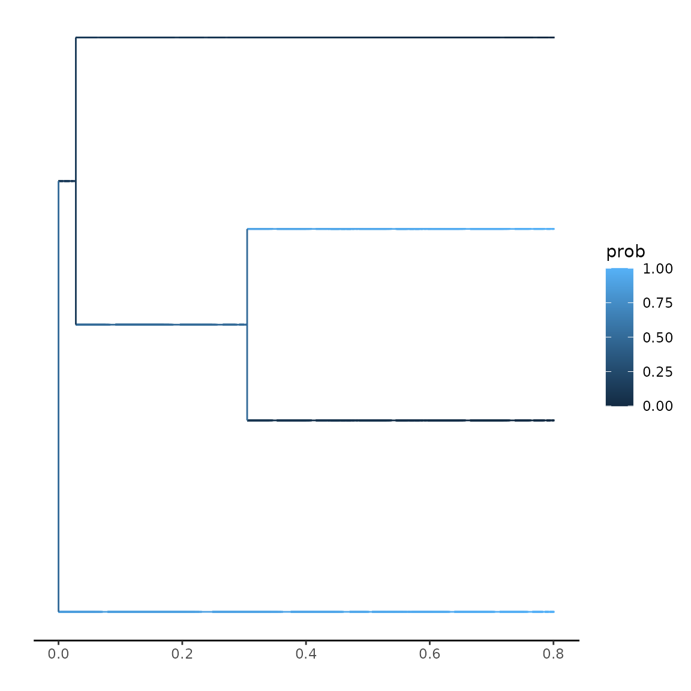
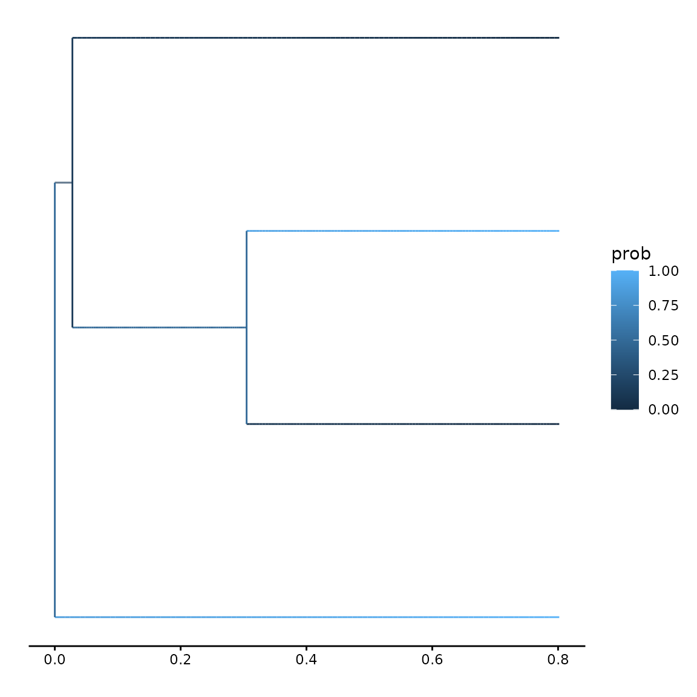

# Plotting probabilities

### Plotting ancestral states

Here, I want to give you a short (and minimal) demonstration of how to
plot your ancestral states alongside your tree. Let us assume we have a
simple tree, with almost trivial traits:

``` r
set.seed(5)
phy <- ape::rphylo(n = 4, birth = 1, death = 0)
traits <- c(0, 1, 1, 0)

plot(phy)
```


A typical likelihood calculation would look like (assuming 2 observed
and 2 hidden traits):

``` r
params <- secsse::id_paramPos(c(0, 1), 2)
params[[1]][] <- c(0.2, 0.2, 0.1, 0.1)
params[[2]][] <- 0.0
params[[3]][, ] <- 0.1
diag(params[[3]]) <- NA


ll <- secsse::secsse_loglik(parameter = params,
                             phy = phy,
                             traits = traits,
                             num_concealed_states = 2,
                             see_ancestral_states = TRUE,
                             sampling_fraction = c(1, 1))
```

    ## Warning: Deduced names and order of used states to be: 0, 1
    ## if this is incorrect, consider passing states as matching numeric 
    ##   ordering, e.g. 1 for the first state, 2 for the second etc.

``` r
ll
```

    ## $LL
    ## [1] -8.605749
    ## 
    ## $ancestral_states
    ##          0A        1A         0B         1B
    ## 7 0.4243298 0.4297629 0.07433058 0.07157672
    ## 6 0.1027373 0.6574616 0.03145469 0.20834647
    ## 5 0.3253326 0.3253326 0.17466735 0.17466735
    ## 
    ## $states
    ##      E_0A E_1A E_0B E_1B      D_0A      D_1A       D_0B       D_1B S_0A S_1A
    ## [1,]    0    0    0    0 1.0000000 0.0000000 1.00000000 0.00000000    1    1
    ## [2,]    0    0    0    0 0.0000000 1.0000000 0.00000000 1.00000000    1    1
    ## [3,]    0    0    0    0 0.0000000 1.0000000 0.00000000 1.00000000    1    1
    ## [4,]    0    0    0    0 1.0000000 0.0000000 1.00000000 0.00000000    1    1
    ## [5,]    0    0    0    0 0.4243298 0.4297629 0.07433058 0.07157672    0    0
    ## [6,]    0    0    0    0 0.1027373 0.6574616 0.03145469 0.20834647    0    0
    ## [7,]    0    0    0    0 0.3253326 0.3253326 0.17466735 0.17466735    0    0
    ##      S_0B S_1B
    ## [1,]    1    1
    ## [2,]    1    1
    ## [3,]    1    1
    ## [4,]    1    1
    ## [5,]    0    0
    ## [6,]    0    0
    ## [7,]    0    0

If we want to visualize the change in trait probabilities across the
tree, we can use the function ‘plot_state_exact’. To use this function,
we need to provide a helper function that can translate the posterior
probabilities into a single probability of interest. For instance, for 2
observed and 2 hidden traits, we observe the following states
reconstructed along the nodes:

``` r
ll$states
```

    ##      E_0A E_1A E_0B E_1B      D_0A      D_1A       D_0B       D_1B S_0A S_1A
    ## [1,]    0    0    0    0 1.0000000 0.0000000 1.00000000 0.00000000    1    1
    ## [2,]    0    0    0    0 0.0000000 1.0000000 0.00000000 1.00000000    1    1
    ## [3,]    0    0    0    0 0.0000000 1.0000000 0.00000000 1.00000000    1    1
    ## [4,]    0    0    0    0 1.0000000 0.0000000 1.00000000 0.00000000    1    1
    ## [5,]    0    0    0    0 0.4243298 0.4297629 0.07433058 0.07157672    0    0
    ## [6,]    0    0    0    0 0.1027373 0.6574616 0.03145469 0.20834647    0    0
    ## [7,]    0    0    0    0 0.3253326 0.3253326 0.17466735 0.17466735    0    0
    ##      S_0B S_1B
    ## [1,]    1    1
    ## [2,]    1    1
    ## [3,]    1    1
    ## [4,]    1    1
    ## [5,]    0    0
    ## [6,]    0    0
    ## [7,]    0    0

Here, the first four rows indicate the tip states, whilst the later
three rows indicate the states at the internal nodes (with the last row
indicating the root, in this case). The columns indicate the four
extinction and four speciation rates, following the order in
params\[\[1\]\] and params\[\[2\]\]. Thus, we have for both, rates 0A,
1A, 0B and 1B. If we are interested in the posterior probability of
trait 0, we have to provide a helper function that sums the
probabilities of 0A and 0B, e.g.:

``` r
helper_function <- function(x) {
  return(sum(x[c(5, 7)]) / sum(x)) # normalized by total sum, just in case.
}
```

We can now use this to plot this probability across the tree. There are
two options for plotting: using the evaluations along the branches as
used by the integration method, or evaluating the branch values at a
specific number of intervals. Using the explicit evaluations is more
precies, but might be memory heavy. Usually, using 10-100 evaluations
per branch provides a very accurate approximation:

``` r
secsse::plot_state_exact(parameters = params,
                 phy = phy,
                 traits = traits,
                 num_concealed_states = 2,
                 sampling_fraction = c(1, 1),
                 prob_func = helper_function)
```

    ## Warning: Deduced names and order of used states to be: 0, 1
    ## if this is incorrect, consider passing states as matching numeric 
    ##   ordering, e.g. 1 for the first state, 2 for the second etc.

    ## Warning: Removed 6 rows containing missing values or values outside the scale range
    ## (`geom_segment()`).



``` r
secsse::plot_state_exact(parameters = params,
                 phy = phy,
                 traits = traits,
                 num_concealed_states = 2,
                 sampling_fraction = c(1, 1),
                 num_steps = 10,
                 prob_func = helper_function)
```

    ## Warning: Deduced names and order of used states to be: 0, 1
    ## if this is incorrect, consider passing states as matching numeric 
    ##   ordering, e.g. 1 for the first state, 2 for the second etc.
    ## Removed 6 rows containing missing values or values outside the scale range
    ## (`geom_segment()`).


``` r
secsse::plot_state_exact(parameters = params,
                 phy = phy,
                 traits = traits,
                 num_concealed_states = 2,
                 sampling_fraction = c(1, 1),
                 num_steps = 100,
                 prob_func = helper_function)
```

    ## Warning: Deduced names and order of used states to be: 0, 1
    ## if this is incorrect, consider passing states as matching numeric 
    ##   ordering, e.g. 1 for the first state, 2 for the second etc.
    ## Removed 6 rows containing missing values or values outside the scale range
    ## (`geom_segment()`).



## Using CLA secsse

For CLA secsse, a similar function is available, which works in the same
way. Borrowing from the example for cla_secsse_loglik, we first prepare
our parameters:

``` r
set.seed(13)
phylotree <- ape::rcoal(12, tip.label = 1:12)
traits <- sample(c(0, 1, 2),
                 ape::Ntip(phylotree), replace = TRUE)
num_concealed_states <- 3
sampling_fraction <- c(1, 1, 1)
phy <- phylotree
# the idparlist for a ETD model (dual state inheritance model of evolution)
# would be set like this:
idparlist <- secsse::cla_id_paramPos(traits, num_concealed_states)
lambd_and_modeSpe <- idparlist$lambdas
lambd_and_modeSpe[1, ] <- c(1, 1, 1, 2, 2, 2, 3, 3, 3)
idparlist[[1]] <- lambd_and_modeSpe
idparlist[[2]][] <- 0
masterBlock <- matrix(4, ncol = 3, nrow = 3, byrow = TRUE)
diag(masterBlock) <- NA
idparlist[[3]] <- q_doubletrans(traits, masterBlock, diff.conceal = FALSE)
# Now, internally, clasecsse sorts the lambda matrices, so they look like
#  a list with 9 matrices, corresponding to the 9 states
# (0A,1A,2A,0B, etc)

parameter <- idparlist
lambda_and_modeSpe <- parameter$lambdas
lambda_and_modeSpe[1, ] <- c(0.2, 0.2, 0.2, 0.4, 0.4, 0.4, 0.01, 0.01, 0.01)
parameter[[1]] <- prepare_full_lambdas(traits, num_concealed_states,
lambda_and_modeSpe)
parameter[[2]] <- rep(0, 9)
masterBlock <- matrix(0.07, ncol = 3, nrow = 3, byrow = TRUE)
diag(masterBlock) <- NA
parameter[[3]] <- q_doubletrans(traits, masterBlock, diff.conceal = FALSE)
```

Here, we have 9 different states (3 observed states, and 3 hidden
states), ordered regularly, e.g.: 0A, 1A, 2A, 0B, 1B, 2B, 0C, 1C, 2C. To
observe the change in state 0, we formulate a helper function, noticing
that the first 9 states are the extinction rates:

``` r
helper_function <- function(x) {
  return(sum(x[c(10, 13, 16)]) / sum(x)) # normalized by total sum, just in case
}
```

And then we use these for plotting:

``` r
secsse::plot_state_exact(parameters = parameter,
                         phy = phy,
                         traits = traits,
                         num_concealed_states = 3,
                         sampling_fraction = sampling_fraction,
                         cond = "maddison_cond",
                         root_state_weight = "maddison_weights",
                         is_complete_tree = FALSE,
                         prob_func = helper_function,
                         num_steps = 10)
```

    ## Warning: Deduced names and order of used states to be: 0, 1, 2
    ## if this is incorrect, consider passing states as matching numeric 
    ##   ordering, e.g. 1 for the first state, 2 for the second etc.

    ## Warning: Removed 22 rows containing missing values or values outside the scale range
    ## (`geom_segment()`).


